Proyect overview:

In this project, I created a website by designing a portfolio inspired by a figma model, using html and css. I reproduced the structure, design, and layout of the elements to match the reference model. I also implemented a responsive design, adapting the site for both desktop and mobile devices using media queries.

In this work, I organized the code following a structured layout with an assets folder for images, a css file (styles.css) for the style classes, and an index.html file containing the main code. I used flexbox to structure the sections in an organized and coherent way according to the original design.

My website includes a header, a footer, and the sections: home, about, skills, experience, work, testimonials and contact, maintaining both visual and semantic consistency. Finally, I verified that the website is designed clearly, following the given model, resulting in a professional and functional personal portfolio website.

Screenshots:

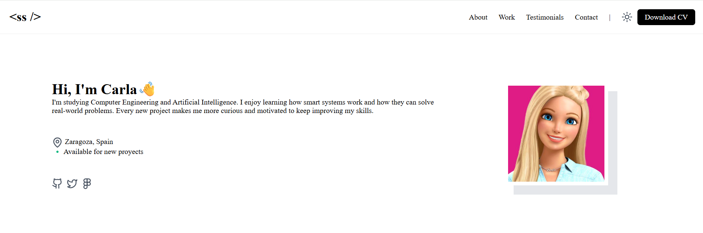
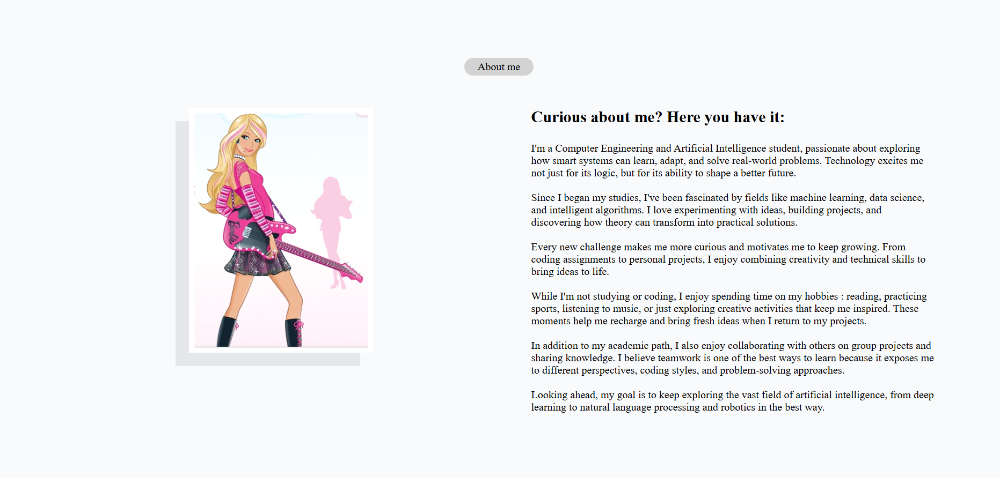
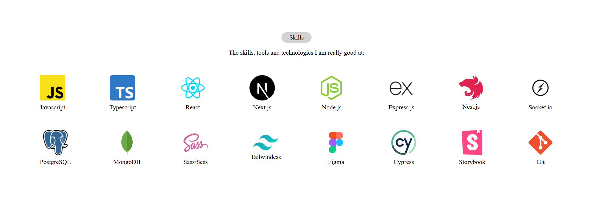
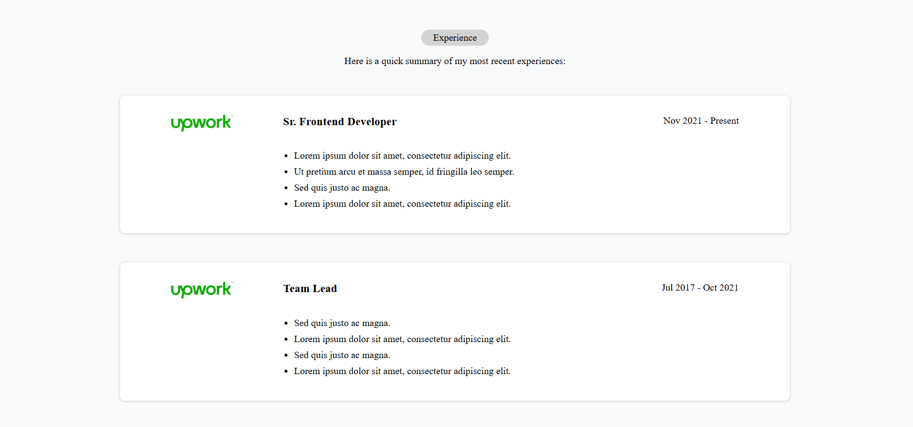
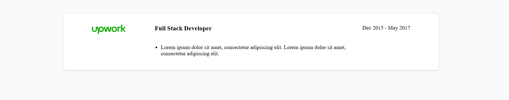

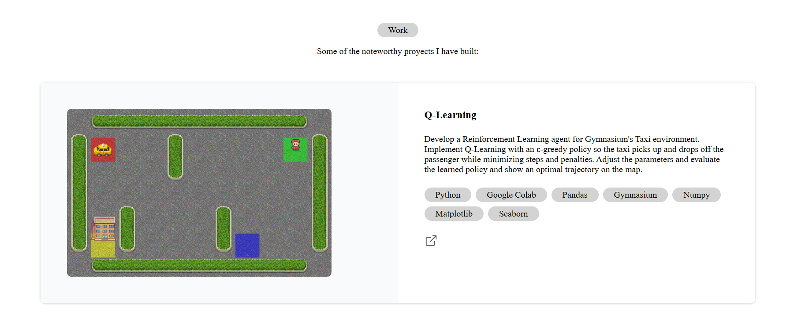
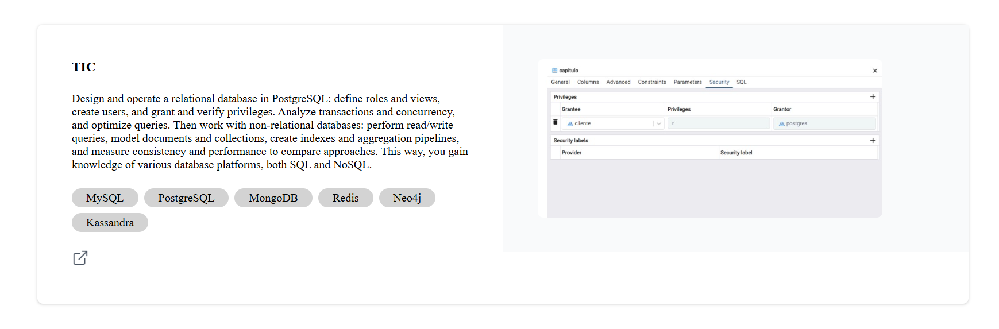

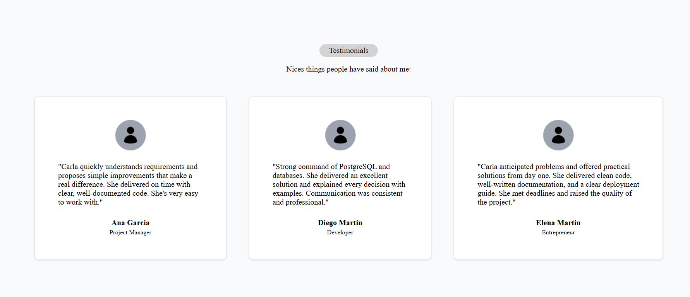

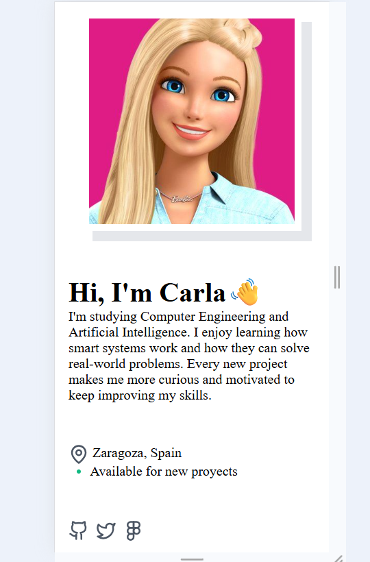
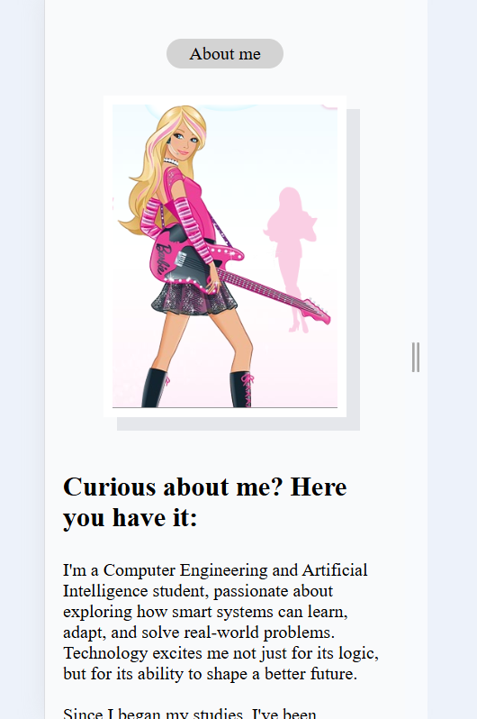
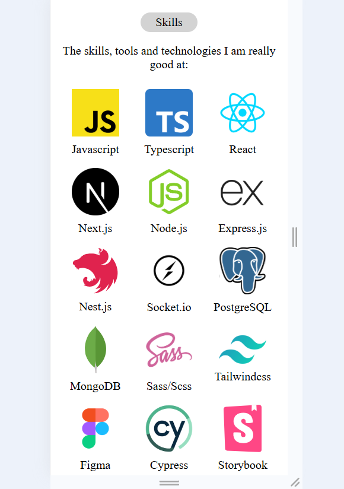
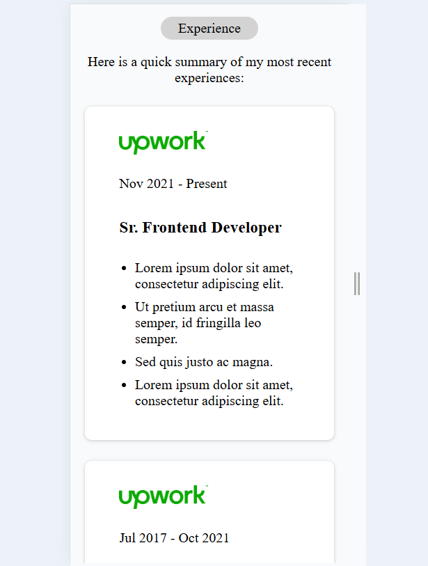
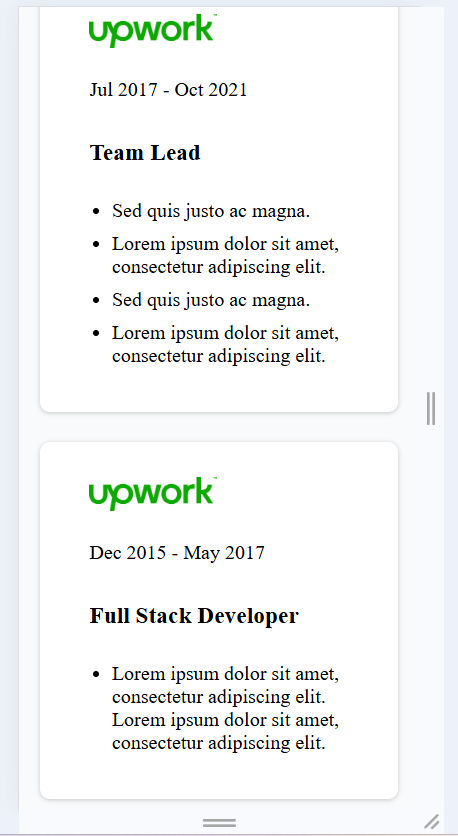
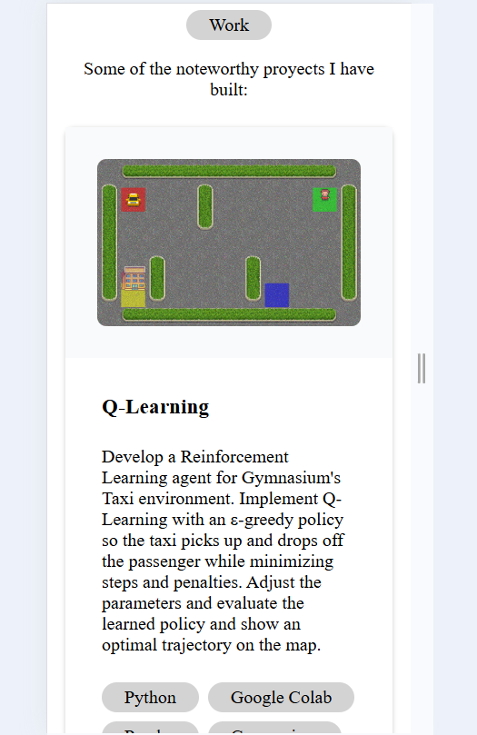

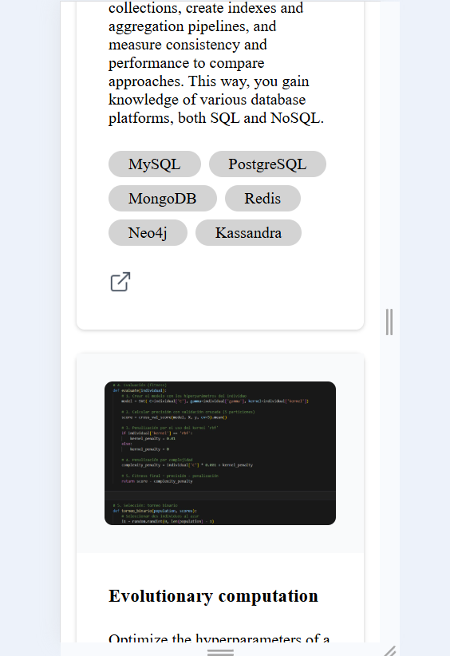
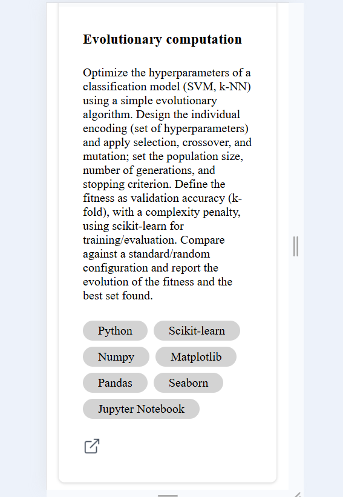
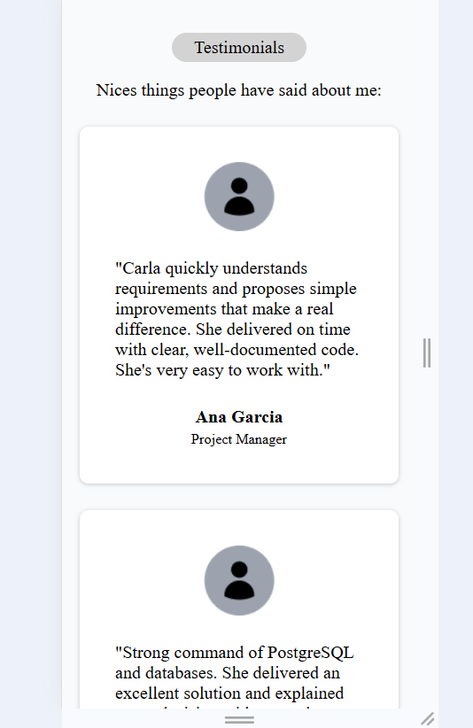
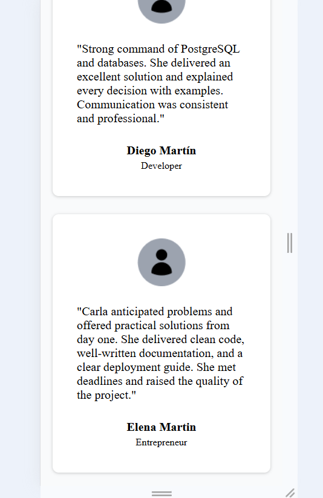
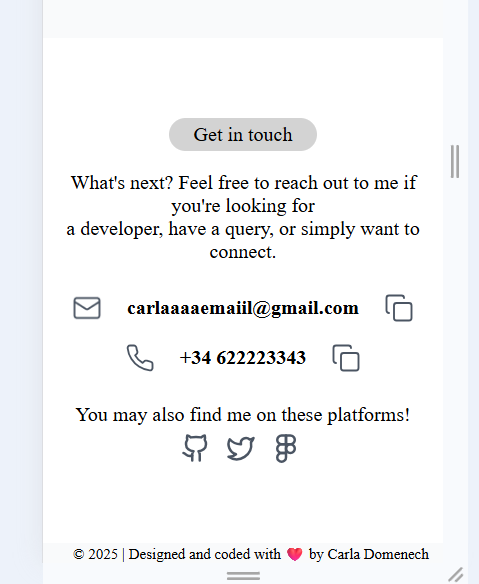

public url -> https://portfolio-carlad5.web.app/
figma link -> https://www.figma.com/community/file/1262992249991763120
github public repo url-> https://github.com/Carla55555/Sistemas-Web

